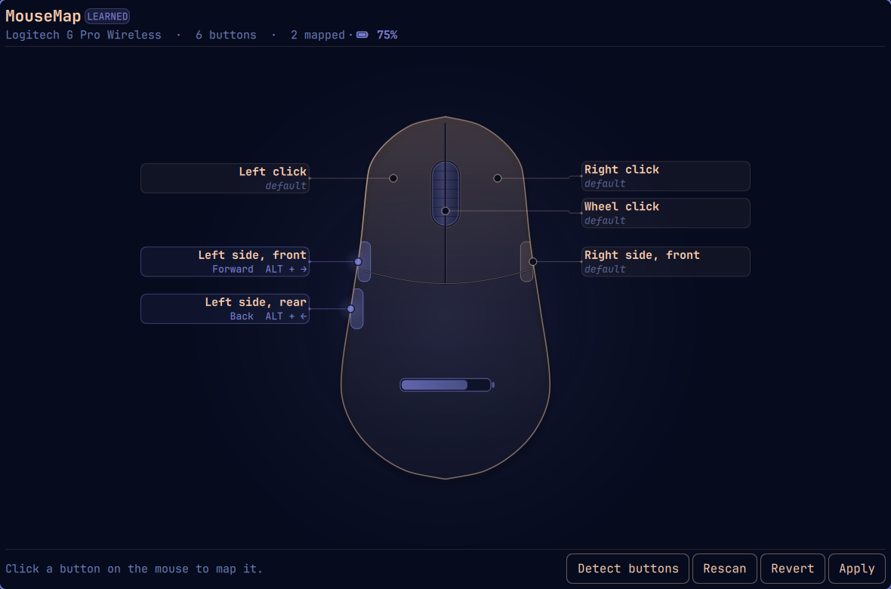

# MouseMap

An Omarchy shell plugin that shows every button on your mouse on a diagram,
with a leader line from each button to a label saying what it does — and lets
you rebind any of them to a shortcut, a window action, or a command.

The diagram is generated from whatever mouse is actually plugged in. A
two-button travel mouse and a seven-button gaming mouse each draw as
themselves, and the leaders land on the right places on the shell.



## Nothing is written to the mouse

This is the important difference from Piper / libratbag, which is the usual
answer to remapping a mouse on Linux. Piper flashes the mouse's **onboard
memory**, so your remaps follow the device to every machine you plug it into.

MouseMap never touches the hardware. Everything it does is a Hyprland
keybinding on *this* machine, scoped to *this* device name. Plug the mouse
into another computer and it behaves exactly as it did out of the box.

## Install

```bash
./install
omarchy plugin enable steezy.mousemap
omarchy-shell shell toggle steezy.mousemap
```

`install` copies into `~/.config/omarchy/plugins/steezy.mousemap`. It copies
rather than symlinks on purpose: Quickshell watches the plugin tree for
changes and does not follow a symlinked directory, so a symlinked install
silently stops hot-reloading.

Re-run `./install` after editing. QML components are cached once loaded, so
changes to an already-open panel need `omarchy restart shell`.

## Using it

Click any button on the diagram, or its label, and pick what it should do.
Nothing is live until you press **Apply**.

- **Navigate** — Back, Forward, tab switching, reload
- **Edit** — copy, paste, cut, undo, redo, find
- **Window** — close, fullscreen, float/tile, pin
- **Workspace** — next, previous, last, scratchpad
- **Omarchy** — menu, launcher, screenshot, clipboard history, emoji picker
- **Media** — volume, play/pause, track skip
- **Custom** — record any key combo, or run any command

Left and right click are shown but flagged: binding them takes the click
away everywhere, including in the panel that did it.

### Detect buttons

Behind a Logitech Unifying or Lightspeed receiver, the kernel cannot tell you
which buttons the mouse has. The receiver is a HID multiplexer and advertises
the union of everything it *could* ever carry — all sixteen `BTN_MOUSE` codes
plus a full keyboard — regardless of what is paired to it. That is why a
capability list alone is not trustworthy.

**Detect buttons** resolves it by watching: it temporarily binds every
candidate button code, you press each button on your mouse, and whatever
fires is recorded as the real button list. Left and right click are left
alone so you can still click. Press **Apply** to keep the result.

If a button never shows up during a detect pass, it is probably not sending a
mouse button at all — see below.

### Battery

Wireless mice that speak HID++ report their charge through the kernel, and
MouseMap shows it in the header and draws it on the mouse's palm. The reading
is matched to the mouse by sysfs path rather than by name, so it stays correct
when two of the same model are paired to one receiver. Wired mice simply have
no battery section.

## Buttons that type instead of clicking

Plenty of mouse buttons never send a mouse button at all. A Logitech onboard
profile that assigns a button a keystroke or a G-shift macro makes it arrive
as a **keyboard key**, from the receiver's keyboard interface rather than its
pointer one. A G Pro Wireless can easily have one thumb button sending `2` and
the other sending `Left Ctrl`.

MouseMap handles these. The same physical mouse appears in Hyprland a second
time as a keyboard, with its own device name, so the key can be bound scoped
to *that* device — the mouse and nothing else. Your real keyboard keeps
working normally, and the button stops typing because the compositor now
consumes it.

This is why per-device scoping is not optional for such a button: binding a
bare `2` or `Ctrl` globally would swallow that key everywhere and break
typing. Generation refuses to emit one unscoped, and says so in the panel
rather than doing it anyway.

Detection covers them too — the guided pass watches the mouse's keyboard
device alongside its buttons, which is only safe because every one of those
probe binds is scoped to the mouse.

If you would rather have real mouse buttons, reassign them in the mouse's
onboard profile with G HUB or `piper`/`ratbagd`. Be aware that this writes to
the mouse, so unlike everything else here it *does* follow the device to
other machines.

To see exactly what each button emits:

```bash
sudo ./scripts/mousemap-sniff             # with a terminal
pkexec ./scripts/mousemap-sniff --seconds 30   # without one
```

It reads the evdev stream directly (root-only, read-only) and prints what
every press emits, flagging any button that is sending a keystroke.

## How it works

```
~/.config/omarchy/mousemap.json          your mapping (source of truth)
        │
        ▼  generated on Apply
~/.local/state/omarchy-mousemap/bindings.lua
        │
        ▼  one loader line, added once
~/.config/hypr/bindings.lua
```

The plugin generates a whole file it owns, rather than editing a fenced block
inside your hand-written `bindings.lua`. The only change to your own config is
a single `dofile` line inside `-- BEGIN mousemap` markers, and a one-time
backup is taken at `bindings.lua.mousemap.bak` before that line is ever added.

`dofile` rather than `require`: Hyprland's bootstrap only clears
`package.loaded` for the `default.hypr`, `hypr` and theme prefixes, so a
required module under any other name would be cached and a reload would
silently keep serving the previous mapping.

Bindings are scoped to the device with Hyprland's `device` bind option, so two
different mice can carry two different maps.

### Typing a shortcut

A binding like "Back" works by pressing `Alt+Left` at whatever is focused,
via `send_key_state` down/up rather than `send_shortcut` — Hyprland can leave
the synthetic key latched with the latter, so the modifier sticks down and the
next real keystroke arrives mangled. Omarchy's own clipboard bindings use the
same workaround ([discussion #14099](https://github.com/hyprwm/Hyprland/discussions/14099)).

A virtual keyboard such as `wtype` is also wrong here: it types at the seat,
so a modifier you are physically holding merges into the injected chord.

## Layout

The label placement is isotonic regression (pool-adjacent-violators). Each
chip wants to sit at its button's height; chips must not overlap; and leaders
must not cross. The third falls out of the second as long as chips keep their
anchors' vertical order, which makes the whole thing one-dimensional and
exactly solvable.

The obvious greedy alternative — push each label down until it fits — drifts
badly once a cluster forms near the top, shoving every label below it down
even when there was slack above. PAVA spreads a crowded cluster around its own
centre of mass and leaves everything else where it wanted to be.

The shell silhouette is sampled from one width function, which the button
anchors also call, so a side-button marker can never drift off the drawn edge.

## Files

| | |
|---|---|
| `Devices.js` | discovery: evdev capabilities, receiver detection, battery join |
| `Profiles.js` | shell geometry and the known-device table |
| `Leaders.js` | label placement and leader routing |
| `Actions.js` | what a button can do, and the Lua it compiles to |
| `Config.js` | config shape, Lua generation, the loader hook |
| `MouseCanvas.qml` | the diagram |
| `MouseMapPanel.qml` | the panel |
| `ActionPicker.qml` | the rebinding sidebar |
| `scripts/mousemap` | the only path to the filesystem and the compositor |
| `scripts/mousemap-sniff` | root diagnostic for buttons that will not map |

## Tests

```bash
node tests/test_leaders.js   # layout invariants for 2..16 buttons
node tests/test_config.js    # escaping, config, generated Lua
```

`test_config.js` round-trips hostile strings through the real `lua`
interpreter and syntax-checks generated output with `luac -p`, because the
generated file is executed by the compositor.

## Uninstall

```bash
omarchy plugin disable steezy.mousemap
rm -rf ~/.config/omarchy/plugins/steezy.mousemap
```

Then delete the `-- BEGIN mousemap` … `-- END mousemap` block from
`~/.config/hypr/bindings.lua` and run `hyprctl reload`. Your original file is
at `~/.config/hypr/bindings.lua.mousemap.bak`.

## Requirements

Omarchy 4 (Hyprland 0.56+ with the Lua config), which is where `hl.bind`, the
`device` bind option and `send_key_state` come from. No extra packages.
